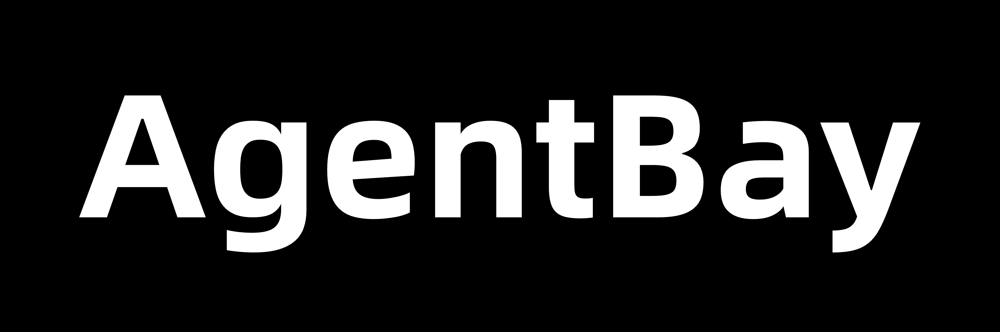

<div align="center">

[](https://pypi.org/project/wuying-agentbay-sdk/)
[](https://www.npmjs.com/package/wuying-agentbay-sdk)
[](https://goreportcard.com/report/github.com/aliyun/wuying-agentbay-sdk/golang)
[](https://github.com/aliyun/wuying-agentbay-sdk/blob/main/LICENSE)

</div>

<p align="center">
  <picture>
    <source media="(prefers-color-scheme: dark)" srcset="./assets/Agentbay-dark.png" width="800px">
    <source media="(prefers-color-scheme: light)" srcset="./assets/Agentbay-light.png" width="800px">
    
  </picture>
</p>

<p align="center">
  <b>The Cloud Sandbox Built for AI Agents</b>
  <br>
  <a href="docs/guides/browser-use/README.md">Browser</a> ·
  <a href="docs/guides/computer-use/README.md">Desktop</a> ·
  <a href="docs/guides/mobile-use/README.md">Mobile</a> ·
  <a href="docs/guides/codespace/README.md">Code</a>
</p>

---

## 📦 Installation

| Language | Install Command | Documentation |
|----------|----------------|---------------|
| Python | `pip install wuying-agentbay-sdk` | [Python Docs](python/README.md) |
| TypeScript | `npm install wuying-agentbay-sdk` | [TypeScript Docs](typescript/README.md) |
| Golang | `go get github.com/aliyun/wuying-agentbay-sdk/golang/pkg/agentbay` | [Golang Docs](golang/README.md) |

## 🚀 Prerequisites

Before using the SDK, you need to:

1. Register an Alibaba Cloud account: [https://aliyun.com](https://aliyun.com)
2. Get APIKEY credentials: [AgentBay Console](https://agentbay.console.aliyun.com/service-management)
3. Set environment variable:
   - For Linux/MacOS:
```bash
    export AGENTBAY_API_KEY=your_api_key_here
```
   - For Windows:
```cmd
    setx AGENTBAY_API_KEY your_api_key_here
```

## 🚀 Quick Start

### Python
```python
from agentbay import AgentBay

# Create session and execute command
agent_bay = AgentBay()
session_result = agent_bay.create()
session = session_result.session
result = session.command.execute_command("echo 'Hello AgentBay'")
print(result.output)  # Hello AgentBay

# Clean up
agent_bay.delete(session)
```

### TypeScript
```typescript
import { AgentBay } from 'wuying-agentbay-sdk';

// Create session and execute command
const agentBay = new AgentBay();
const sessionResult = await agentBay.create();
const session = sessionResult.session;
const result = await session.command.executeCommand("echo 'Hello AgentBay'");
console.log(result.output);  // Hello AgentBay

// Clean up
await agentBay.delete(session);
```

### Golang
```go
import "github.com/aliyun/wuying-agentbay-sdk/golang/pkg/agentbay"

// Create session and execute command
client, err := agentbay.NewAgentBay("", nil)
if err != nil {
    fmt.Printf("Failed to initialize AgentBay client: %v\n", err)
    return
}

sessionResult, err := client.Create(nil)
if err != nil {
    fmt.Printf("Failed to create session: %v\n", err)
    return
}

session := sessionResult.Session
result, err := session.Command.ExecuteCommand("echo 'Hello AgentBay'")
if err != nil {
    fmt.Printf("Failed to execute command: %v\n", err)
    return
}
fmt.Println(result.Output)  // Hello AgentBay

// Clean up
_, err = client.Delete(session, false)
if err != nil {
    fmt.Printf("Failed to delete session: %v\n", err)
    return
}
```

## 📚 Documentation

**[Complete Documentation](docs/README.md)** - Full guides, tutorials, and API references

### 👋 Choose Your Learning Path

**🆕 New Users** - If you're new to AgentBay or cloud development:
- [Quick Start Tutorial](docs/quickstart/README.md) - Get started in 5 minutes
- [Core Concepts](docs/quickstart/basic-concepts.md) - Understand cloud environments and sessions

**🚀 Experienced Users** - Already familiar with browser automation, computer use, mobile testing, or cloud development environments:
- Choose your environment:
  - 🌐 [Browser Automation](docs/guides/browser-use/README.md) - Web scraping, testing, form filling with stealth capabilities
  - 🖥️ [Computer/Windows Automation](docs/guides/computer-use/README.md) - Desktop UI automation and window management
  - 📱 [Mobile Automation](docs/guides/mobile-use/README.md) - Android UI testing and gesture automation
  - 💻 [CodeSpace](docs/guides/codespace/README.md) - Cloud-based code execution environments
- [Feature Guides](docs/guides/README.md) - Complete feature introduction
- **API Reference** - Comprehensive API documentation with examples
  - [Python API Reference](python/docs/api/) - Auto-generated from source code
  - [TypeScript API Reference](typescript/docs/api/) - Auto-generated from source code
  - [Golang API Reference](golang/docs/api/) - Auto-generated from source code
  - 📝 All API docs include complete runnable examples and actual output
- [Cookbook](cookbook/README.md) - Real-world examples and recipes

## 🔧 Core Features

### 🎛️ Session Management
- **Session Creation & Lifecycle** - Create, manage, and delete cloud environments
- **Environment Configuration** - Configure SDK settings, regions, and endpoints  
- **Session Monitoring** - Monitor session status and health validation

### 🛠️ Common Modules
- **Command Execution** - Execute Shell commands in cloud environments
- **File Operations** - Upload, download, and manage cloud files
- **Data Persistence** - Save and retrieve data across sessions
- **Context Management** - Synchronize data and maintain state

### 🎯 Scenario-Based Features
- **Computer Use** - General automation and desktop operations
- **Browser Use** - Web automation, scraping, and browser control  
- **CodeSpace** - Code execution and development environment
- **Mobile Use** - Mobile device simulation and control

## 🤖 AI-Assisted Development

If you're using AI coding assistants (Claude, Cursor, GitHub Copilot, etc.) to develop with AgentBay SDK, you can use [llms.txt](./llms.txt) and [llms-full.txt](./llms-full.txt) as context for better code suggestions:

- **[llms.txt](./llms.txt)** - Concise documentation index (~900 tokens) for quick reference
- **[llms-full.txt](./llms-full.txt)** - Complete documentation corpus (~140k tokens) for comprehensive context

These files contain the full SDK documentation across all languages (Python, TypeScript, Golang), API references, and cookbook examples. Simply reference them in your AI assistant to get better understanding of the SDK's architecture and APIs.

## 🆘 Get Help

- [GitHub Issues](https://github.com/aliyun/wuying-agentbay-sdk/issues)

## 📞 Contact

Welcome to visit our product website and join our community!

- 🌐 **AgentBay International Website**: [https://www.alibabacloud.com/product/agentbay](https://www.alibabacloud.com/product/agentbay)  
- 🇨🇳 **AgentBay China Website (Chinese)**: [https://www.aliyun.com/product/agentbay](https://www.aliyun.com/product/agentbay)  
- 💬 **Discord Community**: [Join on Discord](https://discord.gg/kW55nTcT)  
- 💼 **DingTalk Group**: [Click to join](https://qr.dingtalk.com/action/joingroup?code=v1,k1,ZlCDtu+p3xq2MqVoIA3nYrvEWA21Gq86N91t9OuythQ=&_dt_no_comment=1&origin=11)

## 📄 License

This project is licensed under the Apache License 2.0 - see the [LICENSE](LICENSE) file for details.