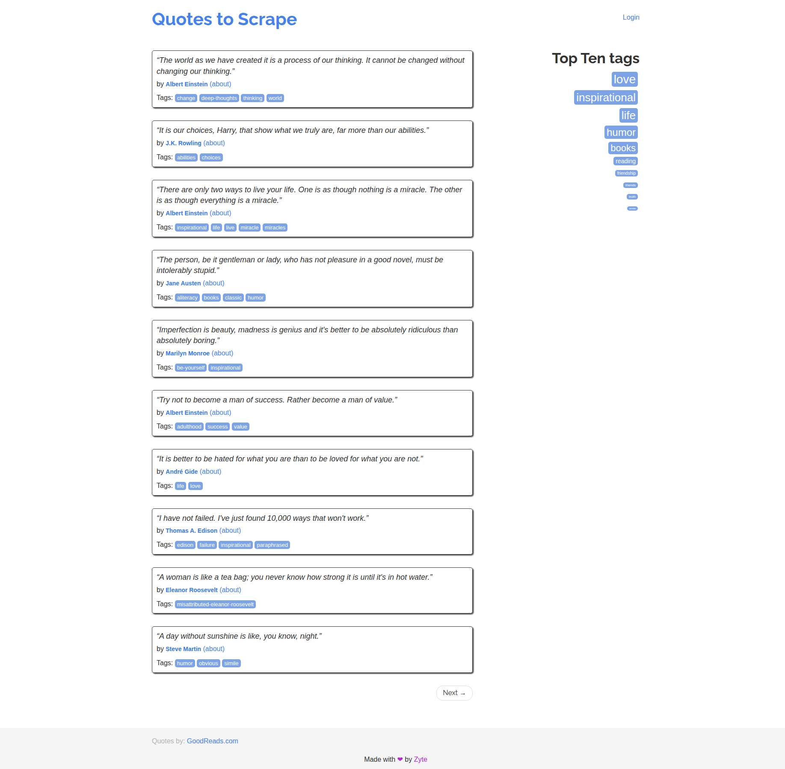
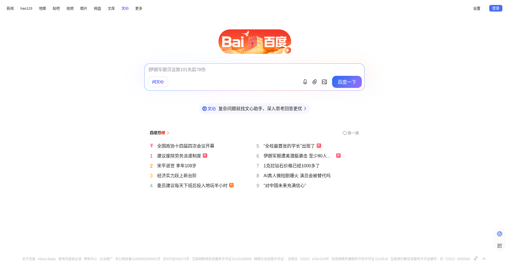
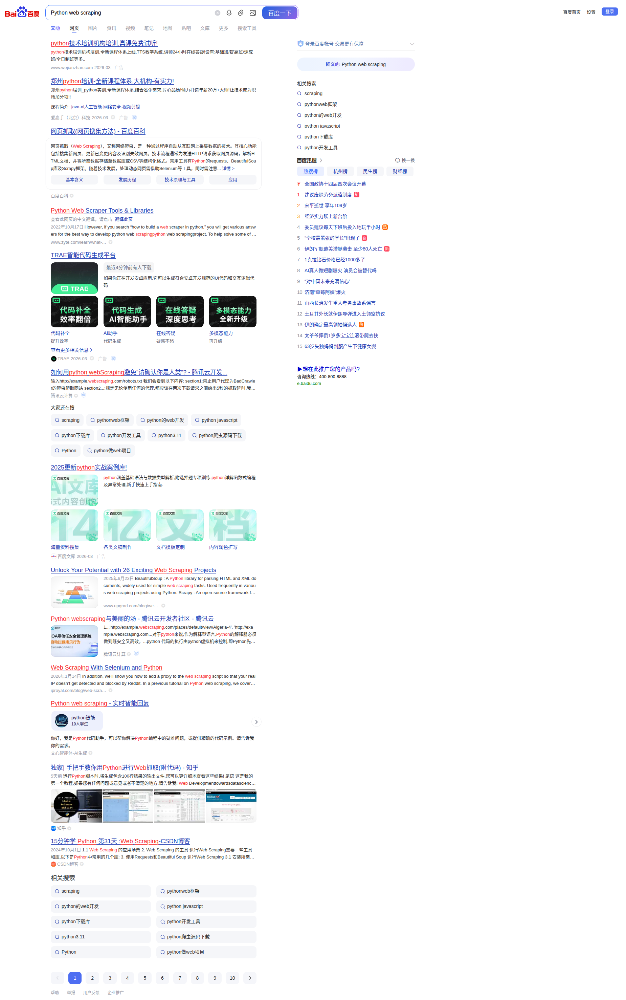

# Web Scraping Pipeline with Browser Operator

Build a complete web scraping pipeline using a cloud browser — from navigation to structured data extraction to storage — without worrying about IP bans, browser setup, or anti-scraping measures.

## What You'll Build

A Python script that:
1. Launches a cloud browser with stealth mode
2. Extracts structured data from a website using AI-powered extraction
3. Saves the data to the cloud file system
4. Processes results with command-line tools
5. (Bonus) Searches a search engine and extracts results



## Prerequisites

- Python 3.8+
- An AgentBay API key ([Get one here](https://agentbay.wuying.com))

```bash
pip install wuying-agentbay-sdk pydantic
export AGENTBAY_API_KEY=your_api_key_here
```

## Quick Start

```bash
cd cookbook/browser/web-scraping-pipeline
python python/main.py
```

## How It Works

### Step 1: Initialize Cloud Browser

Create a session and initialize a browser with stealth mode to avoid detection.

```python
from agentbay import AsyncAgentBay, CreateSessionParams
from agentbay._common.models.browser import BrowserOption

agent_bay = AsyncAgentBay(api_key=api_key)
result = await agent_bay.create(CreateSessionParams(image_id="linux_latest"))
session = result.session

option = BrowserOption(use_stealth=True)
await session.browser.initialize(option)
```

### Step 2: Navigate and Extract

Navigate to a website and use AI-powered extraction to pull structured data. Define your data schema with Pydantic, and the operator handles the rest.

```python
from pydantic import BaseModel
from typing import List
from agentbay._common.models.browser_operator import ExtractOptions

class Quote(BaseModel):
    text: str
    author: str

class QuoteList(BaseModel):
    quotes: List[Quote]

await session.browser.operator.navigate("https://quotes.toscrape.com")

options = ExtractOptions(
    instruction="Extract all quotes and their authors from this page.",
    schema=QuoteList,
    use_text_extract=True,
)
success, data = await session.browser.operator.extract(options)
# Extracted 10 quotes with text and author
```

### Step 3: Save to Cloud File System

Store extracted data in the cloud session's file system.

```python
import json

json_data = json.dumps(
    [q.model_dump() for q in data.quotes],
    ensure_ascii=False, indent=2,
)
await session.file_system.write_file("/tmp/quotes.json", json_data)
```

### Step 4: Process with Commands

Run analysis scripts directly in the cloud environment.

```python
result = await session.command.execute_command(
    "python3 -c 'import json; data=json.load(open(\"/tmp/quotes.json\")); "
    "print(f\"Total: {len(data)} quotes\")'",
    timeout_ms=10000,
)
print(result.output)
# Total: 10 quotes
```

### Step 5 (Bonus): Search Engine Scraping

Use `act()` for interactive actions like searching, and `extract()` to pull results.

```python
from agentbay._common.models.browser_operator import ActOptions

await session.browser.operator.navigate("https://www.baidu.com")
await session.browser.operator.act(
    ActOptions(action="Search for 'Python web scraping'")
)
```



```python
class SearchResultList(BaseModel):
    results: List[SearchResult]

options = ExtractOptions(
    instruction="Extract all search result titles and links.",
    schema=SearchResultList,
    use_text_extract=True,
)
success, results = await session.browser.operator.extract(options)
```



## Key APIs

| Method | Description | Use Case |
|--------|-------------|----------|
| `browser.initialize(option)` | Start browser with options | Stealth mode, captcha solving |
| `operator.navigate(url)` | Go to a URL | Open target pages |
| `operator.act(options)` | Perform interactive actions | Click, type, search |
| `operator.extract(options)` | Extract structured data | Pull data into Pydantic models |
| `operator.screenshot()` | Capture browser screenshot | Visual verification |
| `file_system.write_file(path, content)` | Save data to cloud | Store extracted JSON |
| `command.execute_command(cmd)` | Run shell commands | Post-processing with jq, python |

## Extraction Tips

- **`use_text_extract=True`**: Best for text-heavy pages. Stable and fast.
- **`use_vision=True`**: Uses visual analysis. Better for complex layouts but slower.
- **`max_page`**: Set to >1 for automatic pagination (e.g., `max_page=5`).
- **Pydantic schema**: Keep schemas simple. Use `Optional` fields for data that may be missing.
- **Instructions**: Be specific about what to extract. Mention field names from your schema.

## Next Steps

- Add multi-page crawling with `max_page` parameter
- Use `BrowserOption(solve_captchas=True)` for sites with CAPTCHAs
- Combine with AI models for intelligent data analysis
- Scale up with multi-session concurrent scraping (see Multi-Session Orchestration cookbook)
