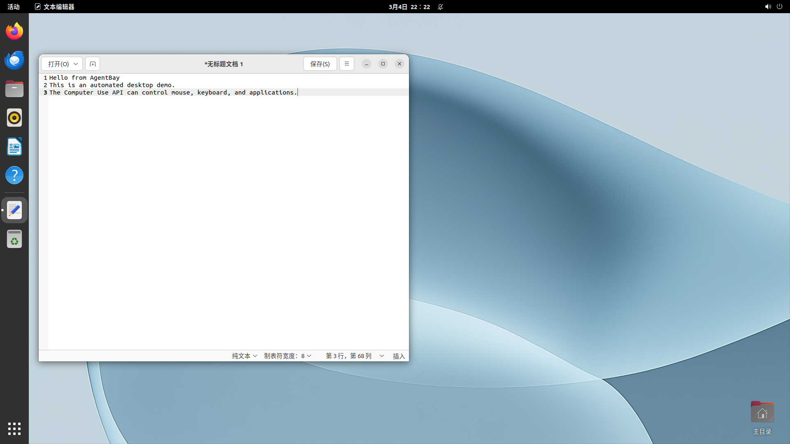
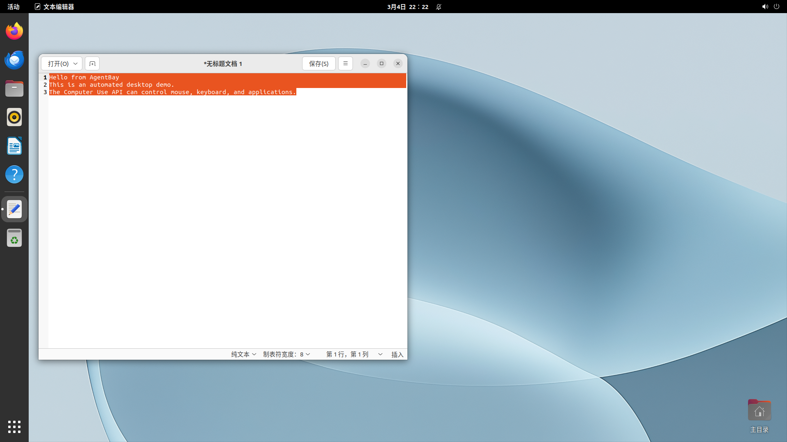
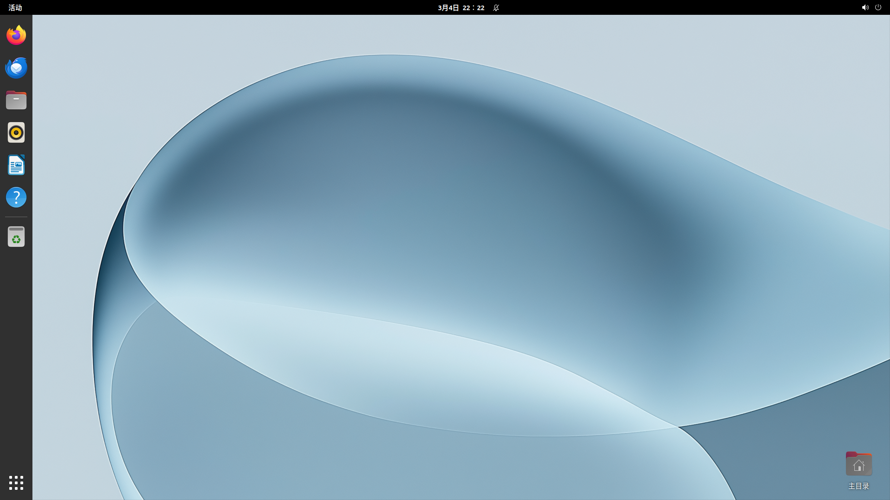

# Desktop GUI Automation with Computer Use

Automate desktop GUI applications in a cloud environment using the AgentBay SDK's Computer Use module — no local desktop setup required.

## What You'll Build

A Python script that remotely controls a Linux desktop: launching a text editor, typing content, saving a file, and verifying the result — all through API calls.


## Prerequisites

- Python 3.8+
- An AgentBay API key ([Get one here](https://agentbay.wuying.com))

```bash
pip install wuying-agentbay-sdk
export AGENTBAY_API_KEY=your_api_key_here
```

## Quick Start

```bash
cd cookbook/computer-use/desktop-gui-automation
python python/main.py
```

## How It Works

### Step 1: Create a Cloud Desktop Session

The SDK creates a cloud Linux desktop and returns a session object with full access to mouse, keyboard, and screen.

```python
from agentbay import AsyncAgentBay, CreateSessionParams

agent_bay = AsyncAgentBay(api_key=api_key)
result = await agent_bay.create(CreateSessionParams(image_id="linux_latest"))
session = result.session
```

### Step 2: Get Screen Info & Take Screenshots

Query the screen size and capture screenshots at any point for visual verification.

```python
screen = await session.computer.get_screen_size()
# {'width': 1920, 'height': 1080, 'dpiScalingFactor': 1.0}

screenshot = await session.computer.beta_take_screenshot("png")
with open("screenshot.png", "wb") as f:
    f.write(screenshot.data)
```

### Step 3: Launch an Application

Use `start_app` to launch any installed application by its command.

```python
start_result = await session.computer.start_app("gedit")
# Started: gedit (PID: 42506)
```


### Step 4: Simulate Keyboard & Mouse

Click at specific coordinates, type text, and use keyboard shortcuts.

```python
await session.computer.click_mouse(960, 540, "left")
await session.computer.input_text("Hello from AgentBay\nThis is an automated desktop demo.")
```



Use Ctrl+A to select all text — useful for copy, replace, or visual confirmation.

```python
await session.computer.press_keys(["ctrl", "a"])
```



### Step 5: Save File via Command Module

For reliable file persistence, use the command module to write content directly.

```python
save_cmd = 'printf "Hello from AgentBay\\nThis is an automated desktop demo.\\n" > /tmp/agentbay_demo.txt'
await session.command.execute_command(save_cmd, timeout_ms=5000)

verify = await session.command.execute_command("cat /tmp/agentbay_demo.txt")
print(verify.output)
# Hello from AgentBay
# This is an automated desktop demo.
```

### Step 6: Clean Up

Close the editor and delete the session.

```python
await session.computer.press_keys(["ctrl", "q"])
await agent_bay.delete(session)
```



## API Reference

| Method | Description | Example |
|--------|-------------|---------|
| `get_screen_size()` | Get screen dimensions and DPI | Returns `{width, height, dpiScalingFactor}` |
| `beta_take_screenshot(format)` | Capture screen as PNG/JPEG bytes | `format="png"` |
| `start_app(cmd)` | Launch an application | `"gedit"`, `"firefox"` |
| `get_installed_apps(...)` | List installed applications | Filter by start_menu, desktop |
| `click_mouse(x, y, button)` | Click at coordinates | `button="left"`, `"right"`, `"double_left"` |
| `move_mouse(x, y)` | Move cursor to position | Coordinates in pixels |
| `drag_mouse(from_x, from_y, to_x, to_y, button)` | Drag from one point to another | `button="left"` |
| `scroll(x, y, direction, amount)` | Scroll at position | `direction="up"`, `"down"` |
| `input_text(text)` | Type text string | Supports `\n` for newlines |
| `press_keys(keys, hold)` | Press key combination | `["ctrl", "s"]`, `["Return"]` |
| `get_cursor_position()` | Get current cursor position | Returns `{x, y}` |
| `list_root_windows()` | List all open windows | Returns window list |
| `get_active_window()` | Get the focused window | Returns window info |

## Tips

- **Wait after launching apps**: GUI applications need time to render. Use `asyncio.sleep(2-3)` after `start_app()`.
- **Use screenshots for debugging**: Take screenshots between steps to verify the GUI state.
- **Screen coordinates**: The default Linux desktop is 1920x1080. Use `get_screen_size()` to get exact dimensions.
- **Key names**: Use lowercase for modifier keys (`ctrl`, `alt`, `shift`) and capitalized names for special keys (`Return`, `Tab`, `Escape`, `BackSpace`).

## Next Steps

- Combine with AI vision models to build intelligent desktop agents
- Use `get_installed_apps()` to discover available applications dynamically
- Add window management (`list_root_windows`, `activate_window`) for multi-window workflows
