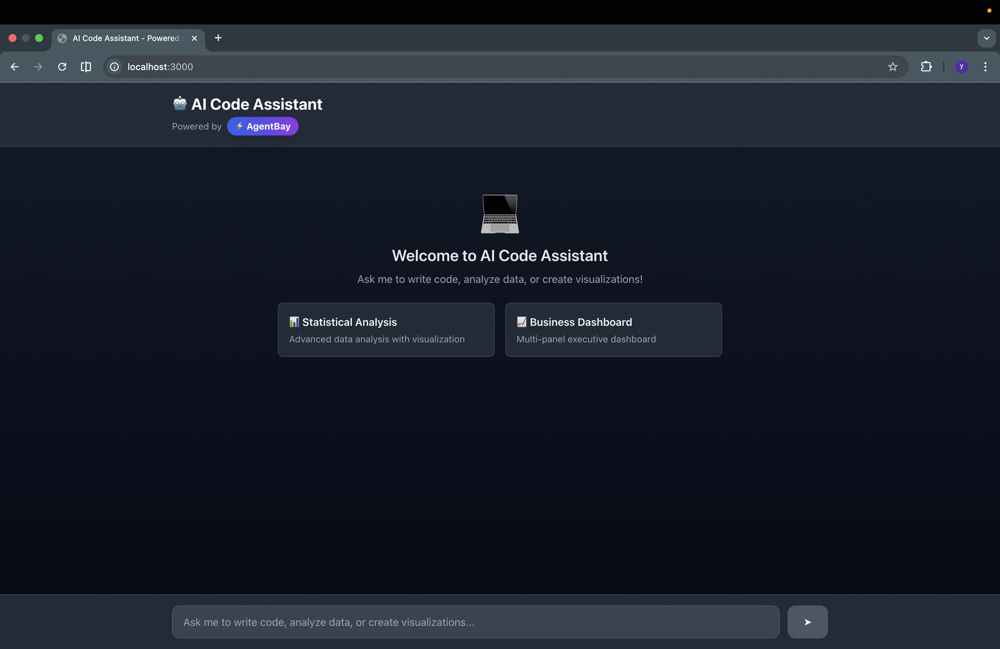

# 🤖 AI Code Assistant

An intelligent web application that combines AI language models with cloud code execution, powered by **AgentBay** and **Alibaba Cloud Qwen**.


## 📸 Screenshots

### Welcome Screen

*Choose from multiple pre-built examples or type your own prompt*

### Code Execution in Progress

*Real-time execution logs show AgentBay cloud session creation and code execution*

### Dashboard Visualization Result

*AI-generated business dashboard with multiple chart types displayed inline*

## 🌟 Features

- **💬 Natural Language Interface** - Chat with AI to write and execute Python code
- **☁️ Cloud Execution** - Run code securely in isolated AgentBay environments
- **🔄 Session Management** - Persistent sessions with automatic cleanup
- **📊 Rich Output** - View code execution results, outputs, and errors
- **🎨 Modern UI** - Clean, responsive interface built with Next.js and Tailwind CSS
- **🚀 Powered by Qwen** - Leverages Alibaba Cloud's advanced language models

## 🎯 Use Cases

- **Data Analysis** - Generate and analyze datasets with Python
- **Visualization** - Create charts and plots with matplotlib
- **Learning** - Experiment with Python code in a safe environment
- **Prototyping** - Quickly test algorithms and data processing logic
- **Code Generation** - Let AI write Python code for specific tasks

## 📋 Prerequisites

Before you begin, ensure you have:

1. **Node.js 18+** installed
2. **AgentBay API Key** - Get it from [AgentBay Console](https://agentbay.console.aliyun.com/service-management)
3. **DashScope API Key** - Get it from [DashScope Console](https://dashscope.console.aliyun.com/)

## 🚀 Quick Start

### 1. Clone and Navigate

```bash
cd /path/to/wuying-agentbay-sdk/cookbook/envs/codespace/ai-code-assistant
```

### 2. Install Dependencies

```bash
npm install
```

### 3. Configure Environment

Copy the example environment file and add your API keys:

```bash
cp .env.example .env
```

Edit `.env` and add your credentials:

```env
AGENTBAY_API_KEY=your_agentbay_api_key_here
DASHSCOPE_API_KEY=your_dashscope_api_key_here
DASHSCOPE_MODEL=qwen-max  # Optional: specify model
```

### 4. Run Development Server

```bash
npm run dev
```

Open [http://localhost:3000](http://localhost:3000) in your browser.

### 5. Try It Out!

Ask the AI assistant to:
- "Generate 100 random numbers and calculate their mean and standard deviation"
- "Create a bar chart showing monthly sales data"
- "Implement the Fibonacci sequence and display the first 20 numbers"

## 🏗️ Architecture

### System Overview

```
┌─────────────┐      ┌──────────────┐      ┌─────────────┐
│   Browser   │ ←──→ │  Next.js API │ ←──→ │  DashScope  │
│  (React UI) │      │   (Backend)  │      │  (Qwen AI)  │
└─────────────┘      └──────┬───────┘      └─────────────┘
                            │
                            ↓
                    ┌───────────────┐
                    │   AgentBay    │
                    │  (Code Exec)  │
                    └───────────────┘
```

### Key Components

#### 1. **Frontend** (`app/page.tsx`)
- React-based chat interface
- Message history management
- Real-time code execution results display
- Session tracking

#### 2. **API Route** (`app/api/chat/route.ts`)
- Handles chat requests
- Manages conversation flow
- Coordinates AI and code execution
- Error handling and logging

#### 3. **DashScope Client** (`lib/dashscope-client.ts`)
- Interfaces with Alibaba Cloud Qwen models
- Handles tool calling (function calling)
- Manages API communication

#### 4. **AgentBay Executor** (`lib/agentbay-executor.ts`)
- Creates and manages cloud sessions
- Executes Python code in isolated environments
- Session caching and cleanup
- Result processing

## 📖 How It Works

### Execution Flow

1. **User Input** → User sends a message through the chat interface
2. **AI Processing** → DashScope (Qwen) analyzes the request
3. **Tool Decision** → AI decides if code execution is needed
4. **Code Generation** → AI generates Python code
5. **Cloud Execution** → Code runs in AgentBay sandbox
6. **Result Processing** → Output/errors are captured
7. **AI Response** → AI interprets results and responds to user

### Session Management

- Each user gets a unique session ID
- Sessions are reused for 10 minutes to maintain state
- Variables and data persist across executions within a session
- Automatic cleanup after timeout

### Tool Calling

The AI has access to an `execute_python` tool:

```typescript
{
  name: 'execute_python',
  description: 'Execute Python code in a secure cloud environment',
  parameters: {
    code: 'The Python code to execute'
  }
}
```

## 🛠️ Development

### Project Structure

```
ai-code-assistant/
├── app/
│   ├── api/chat/
│   │   └── route.ts          # Chat API endpoint
│   ├── page.tsx               # Main chat interface
│   ├── layout.tsx             # App layout
│   └── globals.css            # Global styles
├── components/
│   ├── CodeBlock.tsx          # Code execution display
│   └── LoadingSpinner.tsx     # Loading animation
├── lib/
│   ├── agentbay-executor.ts   # AgentBay integration
│   └── dashscope-client.ts    # DashScope API client
├── package.json
├── tsconfig.json
├── tailwind.config.js
└── next.config.js
```

### Adding Custom Tools

To add new capabilities, extend the tools array in `app/api/chat/route.ts`:

```typescript
const TOOLS = [
  {
    type: 'function',
    function: {
      name: 'your_tool_name',
      description: 'What your tool does',
      parameters: {
        type: 'object',
        properties: {
          // Define parameters
        },
        required: ['param1'],
      },
    },
  },
];
```

### Environment Variables

| Variable | Required | Description |
|----------|----------|-------------|
| `AGENTBAY_API_KEY` | Yes | AgentBay API key for code execution |
| `DASHSCOPE_API_KEY` | Yes | DashScope API key for AI models |
| `DASHSCOPE_MODEL` | No | Model to use (default: qwen-max) |

## 🔒 Security

- **Isolated Execution** - Code runs in isolated cloud containers
- **No Local Execution** - User code never runs on your server
- **Session Timeout** - Automatic cleanup of inactive sessions
- **API Key Protection** - Keys stored in environment variables only

## 🎨 Customization

### Changing the AI Model

Edit `.env`:

```env
DASHSCOPE_MODEL=qwen-plus  # Faster, more economical
DASHSCOPE_MODEL=qwen-max   # Most capable (default)
```

### Adjusting Session Timeout

Edit `lib/agentbay-executor.ts`:

```typescript
const SESSION_TIMEOUT = 15 * 60 * 1000; // 15 minutes
```

### Styling

The app uses Tailwind CSS. Customize colors in `tailwind.config.js` or modify component styles directly.

## 📊 Performance

- **Session Reuse** - Reduces cold start time by 80%
- **Concurrent Requests** - Handles multiple users simultaneously
- **Fast Response** - Average response time: 2-4 seconds

## 🐛 Troubleshooting

### Common Issues

**Problem**: "DASHSCOPE_API_KEY is required"
- **Solution**: Ensure `.env` file exists and contains your DashScope API key

**Problem**: "Failed to create session"
- **Solution**: Check your AgentBay API key and account quota

**Problem**: Code execution timeout
- **Solution**: Reduce code complexity or increase timeout in executor

### Debug Mode

Enable detailed logging:

```typescript
// In lib/agentbay-executor.ts
console.log('[AgentBay] Debug info:', ...);
```

## 📝 Examples

### Example 1: Data Analysis

**User**: "Generate 1000 random numbers from a normal distribution and calculate statistics"

**AI generates and executes**:
```python
import numpy as np

data = np.random.normal(0, 1, 1000)
print(f"Mean: {np.mean(data):.4f}")
print(f"Std Dev: {np.std(data):.4f}")
print(f"Min: {np.min(data):.4f}")
print(f"Max: {np.max(data):.4f}")
```

### Example 2: Visualization

**User**: "Create a sine and cosine wave plot"

**AI generates and executes**:
```python
import matplotlib.pyplot as plt
import numpy as np

x = np.linspace(0, 2*np.pi, 100)
plt.plot(x, np.sin(x), label='sin(x)')
plt.plot(x, np.cos(x), label='cos(x)')
plt.legend()
plt.grid(True)
plt.show()
```

## 🤝 Contributing

Contributions are welcome! This is part of the AgentBay SDK cookbook.

1. Follow the existing code style
2. Add tests for new features
3. Update documentation
4. Submit a pull request

## 📄 License

This project is part of the AgentBay SDK and is licensed under Apache License 2.0.

## 🔗 Related Resources

- [AgentBay Documentation](https://www.alibabacloud.com/help/agentbay)
- [DashScope Documentation](https://help.aliyun.com/zh/dashscope/)
- [AgentBay SDK GitHub](https://github.com/aliyun/wuying-agentbay-sdk)
- [Next.js Documentation](https://nextjs.org/docs)

## 💡 Tips

- Use clear, specific prompts for better results
- Sessions persist for 10 minutes - reuse them for related tasks
- Check the code before execution in production use cases
- Monitor your API usage in the respective consoles

---

**Built with ❤️ using AgentBay SDK and Alibaba Cloud Qwen**
