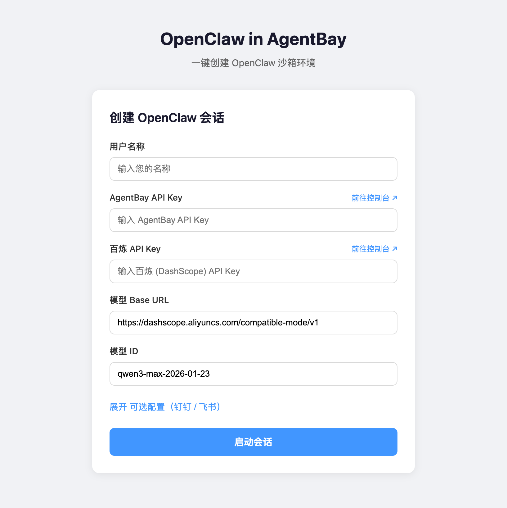
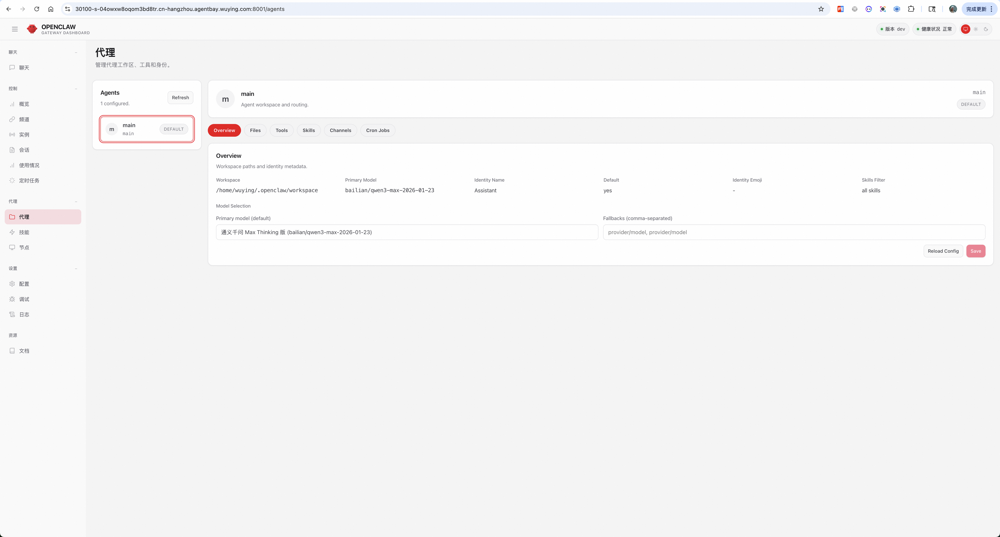
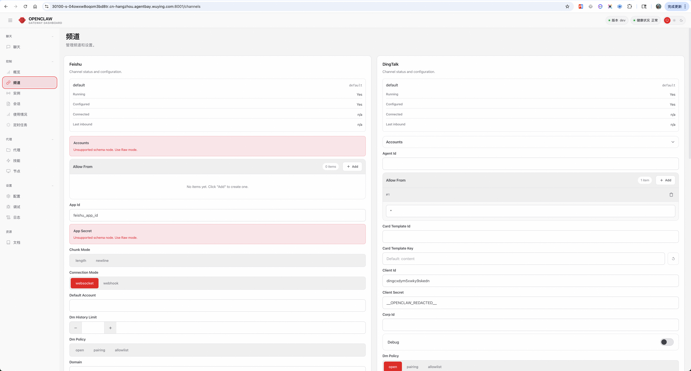

# OpenClaw in AgentBay (Python)

一键创建 OpenClaw 沙箱环境的示例工程，基于 Python FastAPI 后端 + React 前端。

## 功能

- 通过 AgentBay SDK 创建沙箱会话，自动部署 OpenClaw
- 支持 Context 持久化（基于用户名，ARCHIVE 压缩模式）
- 通过 `getLink` 获取 OpenClaw UI 外部访问链接
- 支持自定义模型 Base URL 和模型 ID
- 前端静态文件与 FastAPI 同目录，单进程运行

## 快速开始

### 环境要求

- Python 3.10+
- pip

### 运行

```bash
cd cookbook/openclaw/python

# 安装依赖
pip install -r requirements.txt

# 启动 Web 服务
python main.py
```

访问 `http://localhost:8080` 打开管理页面。



### 启动参数（可选）

```bash
# 指定地址和端口
python main.py --host 0.0.0.0 --port 8080

# 开发模式（代码更改自动重载）
python main.py --reload
```

| 参数 | 说明 |
|------|------|
| `--host` | 绑定地址，默认 0.0.0.0 |
| `--port` | 端口，默认 8080 |
| `--reload` | 开发模式，代码更改自动重载 |

## 项目结构

```
cookbook/openclaw/python/
├── main.py              # Web 服务入口
├── src/
│   ├── __init__.py
│   ├── app.py           # FastAPI 应用
│   ├── config_builder.py # OpenClaw 配置生成
│   ├── models.py        # Pydantic 数据模型
│   ├── session_manager.py # 会话管理核心
│   ├── dingtalk_setup.py # 钉钉一键配置入口（三种后端统一调度）
│   ├── dingtalk_setup_common.py # 共享类型和工具函数
│   ├── dingtalk_setup_playwright.py # Playwright 实现（默认）
│   ├── dingtalk_setup_browser_operator.py # Browser Operator 实现
│   └── dingtalk_setup_browser_agent.py # BrowserUseAgent 实现
├── frontend/            # React 前端源码
│   ├── src/
│   │   ├── App.tsx      # 主应用组件
│   │   └── components/
│   │       ├── SessionForm.tsx      # 创建会话表单
│   │       └── DingtalkSetupPanel.tsx # 钉钉一键配置面板
│   ├── package.json
│   └── vite.config.ts
├── static/              # 前端构建产物
├── images/              # 文档图片
├── requirements.txt
└── README.md
```

### 一键配置钉钉机器人

会话创建成功后，可点击「一键配置钉钉机器人」：

1. **开始配置**：打开钉钉开放平台并展示二维码
2. **扫码登录**：使用钉钉 APP 扫描右侧云机中的二维码
3. **我已登录**：登录成功后点击，系统自动创建应用并提取 Client ID、Client Secret
4. **提交并更新配置**：将凭证写入 OpenClaw 配置并重启 Gateway

### 前端开发

前端源码位于 `frontend/` 目录，使用 React + Vite + TypeScript。

```bash
# 安装依赖
cd frontend
npm install

# 开发模式（热重载，API 代理到 localhost:8080）
npm run dev

# 构建生产版本
npm run build
```

构建后需将 `frontend/dist/` 目录内容复制到 `static/`：

```bash
cp -r frontend/dist/* static/
```

## API

### 会话管理

| 方法   | 路径                    | 说明       |
|--------|------------------------|-----------|
| POST   | `/api/sessions`        | 创建会话   |
| GET    | `/api/sessions/{id}`   | 查询会话   |
| DELETE | `/api/sessions/{id}`   | 销毁会话   |
| GET    | `/api/sessions`        | 列出所有会话 |

### 钉钉一键配置

| 方法   | 路径                                         | 说明                     |
|--------|---------------------------------------------|-------------------------|
| POST   | `/api/sessions/{id}/dingtalk-setup/start`   | 启动配置（打开登录页）     |
| POST   | `/api/sessions/{id}/dingtalk-setup/continue`| 继续配置（登录后创建应用） |
| GET    | `/api/sessions/{id}/dingtalk-setup/status`  | 获取配置状态             |
| POST   | `/api/sessions/{id}/dingtalk-setup/apply`   | 应用凭证到 OpenClaw 配置  |

API 文档：`http://localhost:8080/docs`

---

## 会话功能说明

### Context 持久化

创建会话时填写**用户名称**，系统会为该用户启用 AgentBay Context 持久化：

- **Context 路径**：`/home/wuying/.openclaw`
- **Context 名称**：`openclaw-{用户名}`
- **持久化内容**：OpenClaw 配置、Skills、插件、工作区数据

### 外部访问链接

会话创建成功后，返回的 `openclawUrl` 为 OpenClaw UI 的外部 HTTPS 链接，可直接在本地浏览器访问。

**前置要求**：AgentBay Pro 或 Ultra 版本，`getLink` 默认支持端口 30100–30199。如需开放其他端口，可发邮件至 agentbay_dev@alibabacloud.com 申请加白名单。

### 频道与模型配置

启动 OpenClaw WebUI 后，可在控制台中配置**飞书**、**钉钉**等频道，以及**通义千问**等模型，无需预先设置环境变量。




