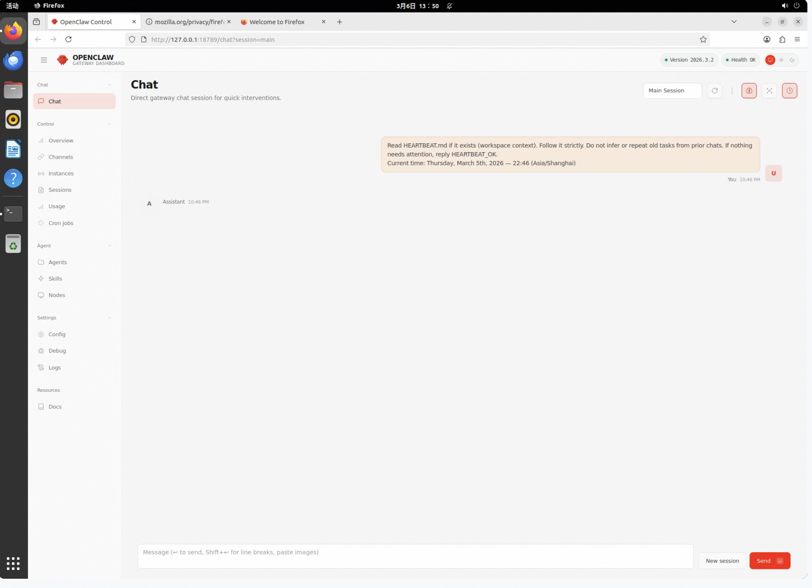
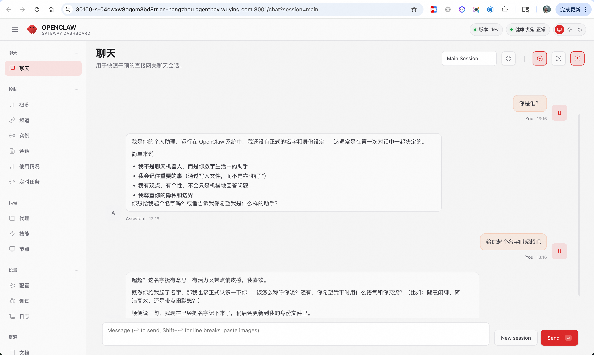

# OpenClaw Session Management Example

This example demonstrates how to create OpenClaw sessions on AgentBay and persist configuration via AgentBay Context.

## Prerequisites

You **only need** to set the following environment variable via `export`:

- `AGENTBAY_API_KEY` (required)

```bash
# Set API Key
export AGENTBAY_API_KEY=your_api_key_here

# Install dependencies
pip install wuying-agentbay-sdk
```

---

## 1. Basic Use

Run the script directly without extra arguments:

```bash
python main.py
```

The script creates an OpenClaw session and starts the dashboard. After startup, you can access the OpenClaw WebUI via **resource_url (sandbox streaming interface)**:

- The console outputs `Desktop URL` (i.e., resource_url)
- Open this URL in your browser to enter the AgentBay cloud desktop
- Inside the cloud desktop, the OpenClaw dashboard runs in the background; access it at a local address (e.g., `http://127.0.0.1:port`)

Press `Ctrl+C` to exit and release the session.



---

## 2. Advanced Use

Run the script with the `--expose-web` argument to expose the OpenClaw WebUI outside the sandbox for direct access in your local browser:

```bash
python main.py --expose-web
```

### Requirements

- **AgentBay version**: AgentBay **Pro** or **Ultra** is required for `get_link` external URL support
- **Port range**: For security, AgentBay `get_link` only supports ports **30100–30199**
- **Gateway port**: The script automatically sets the OpenClaw gateway port to 30100 and configures `bind: lan`, `controlUi.allowedOrigins`, etc., for non-loopback access

### Output

After startup, the console outputs `External Dashboard URL`, an HTTPS address you can open directly in your local browser. Example format:

```
https://gateway.xxx.com/request_ai/xxx/#token=xxx
```



---

## 3. Configure Channels and Models via WebUI

After starting the OpenClaw WebUI, you can configure **channels** and **models** in the console without setting related environment variables in advance. Supported channels include:

- **Feishu**: Configure App ID, App Secret, etc.
- **DingTalk**: Configure Client ID, Client Secret, etc.

Model configuration (e.g., Tongyi Qianwen) can also be done in the WebUI under **Agents** → **Models**, without `DASHSCOPE_API_KEY` or similar environment variables.

**Agent and Model Configuration:**


**Channel Configuration (Feishu / DingTalk):**


---

## 4. AgentBay Context with OpenClaw Image

The script enables **AgentBay Context** by default for data persistence. Used with the OpenClaw image, it keeps configuration and data across sessions.

### Sync Path

- **Context path**: `/home/wuying/.openclaw`
- **Default context name**: `openclaw-files`

### Persisted Data

- OpenClaw config file (`openclaw.json`)
- Skills, plugins, and other extensions
- Workspace and session-related data

### Workflow

1. On first session creation, the context is created if it does not exist
2. When the session starts, `/home/wuying/.openclaw` from the context is synced into the image
3. While the session runs, changes to OpenClaw config are written back to the context
4. After the session is destroyed, data in the context remains for use in the next session

---

## Example Output

```
Initializing AgentBay client...
Getting/creating context: openclaw-files
Context ID: SdkCtx-xxx
Creating session with context sync (path: /home/wuying/.openclaw)...
Session created successfully, Session ID: s-xxx

============================================================
Session Information:
============================================================
  Session ID:    s-xxx
  Context Name:  openclaw-files
  Context ID:    SdkCtx-xxx
  External Dashboard URL: https://gateway.xxx.com/request_ai/xxx/#token=xxx  # only with --expose-web
  Desktop URL:   https://wy.aliyuncs.com/app/xxx
============================================================

Press Ctrl+C to exit and release the session.
```
