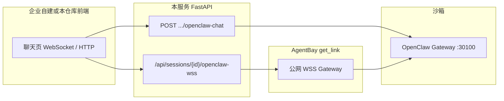

# OpenClaw in AgentBay (Python)

一键创建 OpenClaw 沙箱环境的示例工程，基于 Python FastAPI 后端 + React 前端。

## 功能

- 通过 AgentBay SDK 创建沙箱会话，自动部署 OpenClaw
- 支持 Context 持久化（基于用户名，ARCHIVE 压缩模式）
- 通过 `getLink` 获取 OpenClaw UI 外部访问链接
- **WSS 代理与对话**：通过 `get_link(protocol_type="wss")` 将沙箱内 OpenClaw Gateway 的长连接暴露到外网；本服务提供**同源 WebSocket 代理**与 **HTTP 备用接口**，可与 OpenClaw 实时对话
- **企业可自建聊天页**：任意 Web / 移动端只要持有有效的 `sessionId`，即可连接本服务的 WSS 代理路径或调用 HTTP 接口，定制自己的 OpenClaw 对话 UI（流式、打字机等由前端自行实现；本仓库 `/chat` 为参考实现）
- 支持自定义模型 Base URL 和模型 ID
- **钉钉 / 飞书机器人一键配置**：会话创建成功后，可自动完成扫码登录、创建应用、提取凭证并回填到 OpenClaw 配置
- 前端静态文件与 FastAPI 同目录，单进程运行

## 快速开始

### 环境要求

- Python 3.10+
- pip

### 运行

```bash
cd cookbook/openclaw/python

# 安装依赖
pip install -r requirements.txt

# 启动 Web 服务
python main.py
```

访问 `http://localhost:8080` 打开管理页面。


### 启动参数（可选）

```bash
# 指定地址和端口
python main.py --host 0.0.0.0 --port 8080

# 开发模式（代码更改自动重载）
python main.py --reload
```

| 参数 | 说明 |
|------|------|
| `--host` | 绑定地址，默认 0.0.0.0 |
| `--port` | 端口，默认 8080 |
| `--reload` | 开发模式，代码更改自动重载 |

### 日志（默认 DEBUG + 长文本截断策略）

**本地默认**：`python main.py` 时根 logger 与 **uvicorn** 的 `log_level` 均为 **debug**（未设置 `LOG_LEVEL` / `OPENCLAW_LOG_LEVEL` 时）。仅 `uvicorn src.app:app` 时以 `src/app.py` 中的 **DEBUG** 为准。部署建议设置 `LOG_LEVEL=INFO` 或 `WARNING` 降噪。

WSS / HTTP 诊断类日志中的**长字符串**（如整帧 JSON、响应 body）：在 **DEBUG** 且未设置 `OPENCLAW_LOG_MAX_CHARS` 时**不截断**；在 **INFO 及以上** 时默认**截断**（最多 4000 字符），避免刷屏。可通过**环境变量**进一步控制：

| 变量 | 说明 |
|------|------|
| `LOG_LEVEL` 或 `OPENCLAW_LOG_LEVEL` | 覆盖默认级别，例如生产：`export LOG_LEVEL=INFO` |
| `OPENCLAW_LOG_FULL` | `1` / `true` / `yes` / `on` → **始终不截断**（优先级最高） |
| `OPENCLAW_LOG_MAX_CHARS` | 正整数：超过该长度则截断；`0` 或负数 → **不截断** |

示例：

```bash
# 默认已是 DEBUG，长诊断日志一般不截断
python main.py

# 生产：降噪 + 长日志按策略截断
export LOG_LEVEL=INFO
python main.py

# INFO 下仍希望单条更长
export OPENCLAW_LOG_MAX_CHARS=20000
python main.py

# 任意级别强制完整
export OPENCLAW_LOG_FULL=1
python main.py
```

## 项目结构

```
cookbook/openclaw/python/
├── main.py              # Web 服务入口
├── src/
│   ├── __init__.py
│   ├── app.py           # FastAPI 应用
│   ├── config_builder.py # OpenClaw 配置生成
│   ├── models.py        # Pydantic 数据模型
│   ├── session_manager.py # 会话管理核心
│   ├── dingtalk_setup.py # 钉钉一键配置入口（三种后端统一调度）
│   ├── dingtalk_setup_common.py # 钉钉共享类型和工具函数
│   ├── dingtalk_setup_playwright.py # 钉钉 Playwright 实现（默认）
│   ├── dingtalk_setup_browser_operator.py # 钉钉 Browser Operator 实现
│   ├── dingtalk_setup_browser_agent.py # 钉钉 BrowserUseAgent 实现
│   ├── feishu_setup.py # 飞书一键配置入口
│   ├── feishu_setup_common.py # 飞书共享类型和工具函数
│   └── feishu_setup_playwright.py # 飞书 Playwright 实现
├── frontend/            # React 前端源码
│   ├── src/
│   │   ├── App.tsx      # 主应用组件
│   │   ├── pages/
│   │   │   └── OpenClawChatPage.tsx # 独立对话页 /chat（IM 风格，WSS + HTTP 备用）
│   │   └── components/
│   │       ├── SessionForm.tsx      # 创建会话表单
│   │       ├── OpenClawChatPanel.tsx # OpenClaw 对话面板（WSS 同源代理）
│   │       ├── DingtalkSetupPanel.tsx # 钉钉一键配置面板
│   │       └── FeishuSetupPanel.tsx # 飞书一键配置面板
│   ├── package.json
│   └── vite.config.ts
├── static/              # 前端构建产物
├── images/              # 文档图片
├── requirements.txt
└── README.md
```

### 一键配置钉钉 / 飞书机器人

会话创建成功后，可点击「一键配置钉钉机器人」或「一键配置飞书机器人」，系统将在沙箱内自动打开浏览器，引导完成扫码登录、创建应用、提取凭证并回填到 OpenClaw 配置。

**钉钉配置流程：**

1. **开始配置**：打开钉钉开放平台并展示二维码
2. **扫码登录**：使用钉钉 APP 扫描右侧云机中的二维码
3. **我已登录**：登录成功后点击，系统自动创建应用并提取 Client ID、Client Secret
4. **提交并更新配置**：将凭证写入 OpenClaw 配置并重启 Gateway

**飞书配置流程：**

1. **开始配置**：打开飞书开放平台并展示二维码
2. **扫码登录**：使用飞书 APP 扫描右侧云机中的二维码
3. **我已登录**：登录成功后点击，系统自动创建企业自建应用、添加机器人能力、开通权限、配置事件订阅（长连接）、版本发布并提取 App ID、App Secret
4. **提交并更新配置**：将凭证写入 OpenClaw 配置并重启 Gateway

### 前端开发

前端源码位于 `frontend/` 目录，使用 React + Vite + TypeScript。

```bash
# 安装依赖
cd frontend
npm install

# 开发模式（热重载，API 代理到 localhost:8080）
npm run dev

# 构建生产版本
npm run build
```

构建后需将 `frontend/dist/` 目录内容复制到 `static/`：

```bash
cp -r frontend/dist/* static/
```

## WSS 代理与 OpenClaw 对话（企业可自建聊天页）

沙箱内的 OpenClaw Gateway 默认监听 **30100** 端口。AgentBay 的 `get_link` 可将该端口以 **WSS** 形式映射到公网（与 OpenClaw UI 的 HTTPS 链接同属 Gateway 端口能力，**Pro / Ultra** 默认可用 **30100–30199**，其他端口需向官方申请加白）。

本 cookbook 在此基础上提供两层能力：**对外长连接地址**（AgentBay 暴露）与 **应用内同源代理**（FastAPI 转发），便于浏览器与自建前端安全接入。

### 链路说明



### 方式一：同源 WebSocket 代理（推荐用于浏览器 / H5）

前端使用**当前站点**的 WebSocket URL（与页面同域，避免部分环境下的跨域与证书问题）：

- **非 HTTPS 页面**：`ws://{host}:{port}/api/sessions/{sessionId}/openclaw-wss`
- **HTTPS 页面**：`wss://{host}/api/sessions/{sessionId}/openclaw-wss`

服务端会再连接到 `get_link` 返回的外网 WSS，并完成 OpenClaw **协议 v3** 的握手（如 `connect.challenge` → 带 `auth.token` 的 `connect`），之后**双向透传**帧数据。实现参考：`src/app.py` 中 `openclaw_wss_proxy`，前端参考：`OpenClawChatPanel.tsx`、`OpenClawChatPage.tsx` 中的 `buildProxyWssUrl`。

**内置页面**：管理页「OpenClaw 对话」面板，以及独立 IM 页 **`/chat?sessionId={sessionId}`**（「与 OpenClaw 对话」链接），均使用该代理。

### 方式二：获取外网 WSS 地址（适合服务端、原生客户端）

若你的聊天逻辑跑在**后端或 App 内**，可调用：

`GET /api/sessions/{sessionId}/openclaw-wss-url`

返回 JSON：`wssUrl`（已在 query 中附带 `token`）、`gatewayToken`。你需自行实现与 OpenClaw Gateway 的 WebSocket 协议（`minProtocol` / `maxProtocol`、角色与 scopes、订阅消息等），与本仓库代理内逻辑保持一致即可对接。

### 方式三：HTTP 备用对话（简单集成或 Gateway 流式能力受限时）

当部分 Gateway 版本不支持会话级 WebSocket 订阅、或仅需「一问一答」时，可调用：

`POST /api/sessions/{sessionId}/openclaw-chat`  
Body：`{"message": "用户输入"}`  

服务端会依次尝试 Gateway 的 HTTP 接口（如 `/v1/agent/run`、`/v1/responses`），必要时在沙箱内执行 `openclaw agent --local --message` 作为兜底。本仓库 `/chat` 页面在 WSS 长时间无增量回复时会自动走该路径，企业自建页也可只依赖此接口快速上线。

### 企业自建聊天页的要点

| 目标 | 建议 |
|------|------|
| 与官方 Control UI 体验一致的流式对话 | 使用 **方式一** 连接同源 WSS 代理，按 OpenClaw 网关事件解析 `chat.delta` / `chat.done` 等（可参考 `OpenClawChatPage.tsx`） |
| 最小改造成本、服务端聚合 | 使用 **方式三** HTTP 接口 |
| 完全自建协议栈 | **方式二** 取 `wssUrl`，在后端完成握手与鉴权，勿将 token 泄露给不可信环境 |

**前置条件**：与会话管理相同，需有效的 AgentBay API Key；WSS / HTTPS 外链能力受套餐与端口白名单约束，见下文「外部访问链接」。

## API

### 会话管理

| 方法   | 路径                    | 说明       |
|--------|------------------------|-----------|
| POST   | `/api/sessions`        | 创建会话   |
| GET    | `/api/sessions/{id}`   | 查询会话   |
| DELETE | `/api/sessions/{id}`   | 销毁会话   |
| POST   | `/api/sessions/{id}/pause`  | 休眠会话（降低资源占用） |
| POST   | `/api/sessions/{id}/resume` | 恢复已休眠的会话 |
| GET    | `/api/sessions`        | 列出所有会话 |

### 钉钉一键配置

| 方法   | 路径                                         | 说明                     |
|--------|---------------------------------------------|-------------------------|
| POST   | `/api/sessions/{id}/dingtalk-setup/start`   | 启动配置（打开登录页）     |
| POST   | `/api/sessions/{id}/dingtalk-setup/continue`| 继续配置（登录后创建应用） |
| GET    | `/api/sessions/{id}/dingtalk-setup/status`  | 获取配置状态             |
| POST   | `/api/sessions/{id}/dingtalk-setup/apply`   | 应用凭证到 OpenClaw 配置  |

### 飞书一键配置

| 方法   | 路径                                         | 说明                     |
|--------|---------------------------------------------|-------------------------|
| POST   | `/api/sessions/{id}/feishu-setup/start`     | 启动配置（打开登录页）     |
| POST   | `/api/sessions/{id}/feishu-setup/continue`  | 继续配置（登录后创建应用） |
| GET    | `/api/sessions/{id}/feishu-setup/status`    | 获取配置状态             |
| POST   | `/api/sessions/{id}/feishu-setup/apply`   | 应用凭证到 OpenClaw 配置  |

### OpenClaw 对话（WSS 代理 + HTTP 备用）

| 方法 / 类型 | 路径                                         | 说明 |
|-------------|---------------------------------------------|------|
| **WebSocket** | `/api/sessions/{id}/openclaw-wss`           | **同源 WSS 代理**：浏览器连接此路径，服务端经 `get_link(wss)` 转发至沙箱内 Gateway，并完成 OpenClaw v3 握手 |
| GET         | `/api/sessions/{id}/openclaw-wss-url`       | 返回公网 **WSS URL**（含 `token`）与 `gatewayToken`，供服务端或原生客户端直连 Gateway |
| POST        | `/api/sessions/{id}/openclaw-chat`          | **HTTP 对话**：Body `{"message":"..."}`，依次尝试 Gateway HTTP API 与沙箱内 CLI 兜底 |

会话创建成功后，在「OpenClaw 对话」面板点击「连接 OpenClaw」，或打开 **`/chat?sessionId={id}`**，即可经 **WSS 代理**与 OpenClaw 对话；亦可仅用 **HTTP 接口**在企业自有系统中集成。

API 文档：`http://localhost:8080/docs`

---

## 会话功能说明

### Context 持久化

创建会话时填写**用户名称**，系统会为该用户启用 AgentBay Context 持久化，使 OpenClaw 的配置、Skills、插件和工作区数据在会话销毁后仍可保留，下次创建会话时自动恢复。

#### 什么是 Context？

Context 是 AgentBay 提供的**持久化存储容器**，与临时会话不同：

| 特性 | 会话 (Session) | Context |
|------|----------------|---------|
| 生命周期 | 临时，销毁即消失 | 持久，需手动删除才清除 |
| 数据存储 | 不保存 | 持久保存 |
| 共享 | 独立 | 可被多个会话挂载使用 |

#### 本项目的 Context 配置

- **Context 名称**：`openclaw-{用户名}`（按用户名隔离，同一用户多次创建会话共享同一 Context）
- **挂载路径**：`/home/wuying/.openclaw`（沙箱内 OpenClaw 数据目录）
- **同步策略**：ARCHIVE 压缩模式（上传前压缩，适合配置、Skills、插件等文本类文件）
- **持久化内容**：OpenClaw 配置、Skills、插件、工作区数据

#### 同步流程

1. **会话创建时**：从 Context 下载数据到挂载路径，OpenClaw 可直接使用已有配置
2. **会话运行中**：对 `/home/wuying/.openclaw` 的读写与普通文件操作一致
3. **会话销毁时**：将挂载路径下的变更上传回 Context，供下次会话使用

#### 使用建议

- **销毁会话时确保同步完成**：调用 `agent_bay.delete(session, sync_context=True)`，等待上传完成后再返回，避免新会话拿不到最新数据
- **大量文件写入后**：可显式调用 `session.context.sync()` 触发上传，再销毁会话
- **多会话连续创建**：若需立即用新会话访问刚写入的数据，务必使用 `sync_context=True` 或先 `sync()` 再 `delete`

### 会话休眠与恢复

- **会话休眠**：点击「会话休眠」可将沙箱暂时休眠，降低资源占用和成本。休眠后状态显示为「已休眠」。
- **恢复会话**：若当前会话已休眠，可点击「恢复会话」重新唤醒；或通过带 `sessionId` 的链接恢复时，系统会自动唤醒休眠会话后再连接沙箱。

### 外部访问链接

会话创建成功后，返回的 `openclawUrl` 为 OpenClaw UI 的外部 HTTPS 链接，可直接在本地浏览器访问。

**前置要求**：AgentBay Pro 或 Ultra 版本，`getLink` 默认支持端口 30100–30199。如需开放其他端口，可发邮件至 agentbay_dev@alibabacloud.com 申请加白名单。

---

## 对接 AgentBay OpenClaw 沙箱的常见问题与解决方案

### 1. 沙箱保活问题

**问题描述**：用户使用 OpenClaw「养龙虾」，体现一个「养」字——龙虾需要根据用户的记忆和习惯逐渐自进化出具有个性化的特性，因此保存龙虾的运行环境和用户数据至关重要。沙箱长时间无操作可能被回收，导致会话中断、环境丢失。

**解决方案**：

- **控制台配置**：AgentBay 支持在阿里云控制台的「策略配置 → 生命周期管理」中设置**桌面单次运行最长时间**（最长 1000 分钟）和**休眠超期时长**（最长 72 小时）。启用「释放不活跃桌面」后，MCP 和用户交互均满足终止时间后，系统将自动释放不活跃桌面。
- **长期保活**：有强烈需求长期保活的用户，可在阿里云控制台提交工单，申请加入白名单，开通长期保活能力。


### 2. 用户数据同步问题

**问题描述**：会话销毁后，新会话中用户数据未正确恢复或出现数据不一致。

**解决方案**：使用 AgentBay 的 Context 数据持久化能力，在创建会话时挂载 Context，将 OpenClaw 数据目录（`/home/wuying/.openclaw`）与 Context 绑定，实现跨会话数据自动同步。核心实现如下：

```python
from agentbay import AgentBay, ContextSync, CreateSessionParams, SyncPolicy, UploadMode

# 按用户名获取或创建持久化 Context（同一用户多次创建会话共享同一 Context）
context_name = f"openclaw-{request.username}"
context_result = agent_bay.context.get(context_name, create=True)
if not context_result.success:
    raise RuntimeError(f"Failed to get Context: {context_result.error_message}")
context_id = context_result.context.id

# 配置同步策略：ARCHIVE 压缩模式，适合配置、Skills、插件等文本类文件
sync_policy = SyncPolicy.default()
sync_policy.upload_policy.upload_mode = UploadMode.ARCHIVE
sync_policy.extract_policy.delete_src_file = True
sync_policy.extract_policy.extract_current_folder = True
sync_policy.extract_policy.extract = True

# 创建 Context 同步配置：将 Context 挂载到 OpenClaw 数据目录
context_sync = ContextSync.new(
    context_id=context_id,
    path="/home/wuying/.openclaw",  # 沙箱内 OpenClaw 数据目录
    policy=sync_policy,
    beta_wait_for_completion=True,  # 等待 Context 下载完成后再返回会话
)

# 创建会话时绑定 Context
params = CreateSessionParams(image_id=OPENCLAW_IMAGE_ID)
params.context_syncs = [context_sync]
session_result = agent_bay.create(params)
```

销毁会话时建议使用 `agent_bay.delete(session, sync_context=True)`，确保数据上传完成后再返回。

**场景选择建议**：

| 场景 | 同步策略 | 上传模式 |
|------|----------|----------|
| OpenClaw 配置、插件等文本数据（本项目默认） | 默认（自动上传/下载） | ARCHIVE（压缩，节省带宽与存储） |
| 小量配置文件 | 默认 | FILE（原样上传） |
| 只读数据集（如预置模型） | 仅下载 | 按需选择 |
| 需精确控制同步时机 | 手动同步 + 显式调用 `session.context.sync()` | 按需选择 |

### 3. 定制自定义镜像

**问题描述**：若需在 OpenClaw 镜像中预装各类依赖（如部分 Skills 依赖的 npm 包、Python 的 pip 包等），并希望这些安装包在会话间持久存在，Context 仅适用于文件级数据同步，不适用于系统级安装包持久化，此时可通过**定制自定义镜像**解决。

**解决方案**：参见阿里云文档 [创建并管理自定义镜像的完整生命周期](https://help.aliyun.com/zh/agentbay/manage-images/)。
