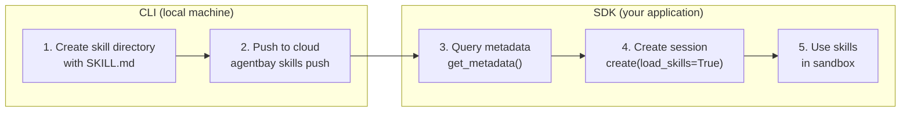

# Skills Guide (Beta)

Skills are reusable capability modules that can be loaded into cloud sandbox sessions, providing pre-configured tools and scripts for AI agents.

## Overview

The Skills feature provides:

- **Skill Creation**: Create skills locally and push them to the cloud via CLI.
- **Metadata Retrieval**: Query available skills and their descriptions without starting a sandbox.
- **Skill Loading**: Automatically load skills into sandbox sessions at creation time.
- **Skill Filtering**: Filter skills by name for selective loading.

## Core Concepts

| Concept | Description |
|---------|-------------|
| **Skill** | A self-contained capability unit stored as a directory. Must include a `SKILL.md` file, and can optionally contain scripts, configs, or other assets. |
| **SKILL.md** | The metadata file in each skill directory. Uses YAML frontmatter to declare `name` and `description`; the body provides usage instructions for LLMs. |
| **skills_root_path** | The unified root directory for skills in the sandbox (e.g. `/home/wuying/skills`). Determined by the backend based on the sandbox image. Each skill is placed at `{skills_root_path}/{skill_name}/`. |

## Typical Workflow



- **Steps 1-2** use the CLI on your local machine to create and upload skills.
- **Steps 3-5** use the SDK in your application code.
- Step 3 (`get_metadata()`) can run **without** a sandbox — useful for building LLM prompts before creating sessions.
- Step 4 tells the backend to place skill files into the sandbox at creation time.

## Prerequisites

- **SDK** (for querying metadata and creating sessions with skills):
  ```bash
  pip install wuying-agentbay-sdk
  export AGENTBAY_API_KEY="your-api-key"
  ```
- **CLI** (for pushing skills to the cloud): see [Installing the CLI](#installing-the-cli) below.

You need the CLI only if you want to create and publish skills. If you only consume existing skills via the SDK, the CLI is not required.

## Installing the CLI

The `agentbay` CLI is used to push local skills to the cloud. Install it via Homebrew (recommended) or download a binary manually.

### Install via Homebrew (Recommended)

```bash
# 1. Add the AgentBay Cloud Homebrew tap
brew tap aliyun/agentbay

# 2. Install the agentbay CLI
brew install agentbay

# 3. Verify installation
agentbay version
```

**Update to the latest version:**

```bash
brew upgrade agentbay
```

**Uninstall:**

```bash
brew uninstall agentbay

# Remove the tap (optional)
brew untap aliyun/agentbay
```

### Manual Download

Download the latest release for your platform from [GitHub Releases](https://github.com/aliyun/agentbay-cli/releases).

## Authentication

Before using skill management commands (`skills push`, `skills show`), authenticate with your Alibaba Cloud account:

```bash
agentbay login
```

The CLI opens a browser for OAuth authentication. Once complete, tokens are saved locally at `~/.config/agentbay/config.json` and refreshed automatically.

To log out:

```bash
agentbay logout
```

## Creating and Publishing Skills (CLI)

Use the `agentbay` CLI to create and manage skills.

### Step 1: Create a Skill Directory

Each skill is a directory containing at least a `SKILL.md` file:

```bash
mkdir my-skill

cat > my-skill/SKILL.md << 'EOF'
---
name: my-skill
description: A useful skill for doing X.
---
# My Skill

Instructions for the AI agent on how to use this skill.

## Usage
1. Read the configuration file at `config.json`
2. Execute the main script with `python main.py`
EOF
```

You can add any additional files the skill needs (scripts, configs, templates, etc.):

```bash
echo '{"key": "value"}' > my-skill/config.json
echo 'print("Hello from my-skill!")' > my-skill/main.py
```

### Step 2: Push to Cloud

Push a local skill directory (or a pre-packaged `.zip`) to the cloud:

```bash
agentbay skills push my-skill/
```

**Output:**

```
[STEP 1/3] Getting upload credential...
[STEP 2/3] Packing and uploading skill...
[STEP 3/3] Creating skill...

[SUCCESS] ✅ Skill created successfully!
[RESULT] Skill ID: <skill-id>
```

The `push` command reads `name` and `description` from `SKILL.md`, packages the directory into a zip, and uploads it. If a skill with the same name already exists, it will be updated.

You can also push a pre-packaged zip directly:

```bash
agentbay skills push my-skill.zip
```

**`SKILL.md` requirements:**

- Must contain a `name:` line (required). The CLI parses this to identify the skill.
- May contain a `description:` line (optional).
- Recommended format is YAML frontmatter as shown above.

### Step 3: View Skill Details

After pushing, use the returned Skill ID to inspect the skill:

```bash
agentbay skills show <skill-id>
```

### Other CLI Commands

```bash
# View skill details
agentbay skills show <skill-id>
```

### CLI Global Options

All commands support the following options:

| Option | Description |
|--------|-------------|
| `--help, -h` | Show help |
| `--verbose, -v` | Enable verbose output (upload URLs, request IDs, etc.) |
| `--version` | Show CLI version |

## Querying Skills Metadata (SDK)

Use `get_metadata()` to discover which skills are available and where they will be located in the sandbox — all **without** creating a session. This is especially useful for:

- **Discovering skills** before deciding which to load.
- **Building LLM system prompts** with skill names, descriptions, and file paths before creating a sandbox (supports lazy sandbox startup).

### What `get_metadata()` Returns

| Field | Description |
|-------|-------------|
| `skills_root_path` | The directory path where skills will be installed in the sandbox (e.g. `/home/wuying/skills`). Determined by the backend based on the sandbox image. |
| `skills` | A list of available skill objects, each with `name` and `description` fields (parsed from the `SKILL.md` frontmatter). |

### Example

```python
from agentbay import AgentBay

agent_bay = AgentBay()

# Get all available skills and their root path
meta = agent_bay.beta_skills.get_metadata()
print(f"Root path: {meta.skills_root_path}")  # e.g. "/home/wuying/skills"
print(f"Available skills ({len(meta.skills)}):")
for skill in meta.skills:
    print(f"  - {skill.name}: {skill.description}")
    # Each skill's files will be at: {meta.skills_root_path}/{skill.name}/

# Filter by specific skill names
meta = agent_bay.beta_skills.get_metadata(skill_names=["my-skill"])

# Specify a particular sandbox image
meta = agent_bay.beta_skills.get_metadata(image_id="linux_latest")
```

## Creating Sessions with Skills

Pass `load_skills=True` to `CreateSessionParams` to tell the backend to load skills into the sandbox at creation time. The skill files will appear at the `skills_root_path` returned by `get_metadata()`.

Note: `get_metadata()` only queries metadata; it does **not** load files into the sandbox. You must pass `load_skills=True` when creating a session for skills to actually be present.

```python
from agentbay import AgentBay, CreateSessionParams

agent_bay = AgentBay()

# 1. Query metadata to learn the root path and available skills
meta = agent_bay.beta_skills.get_metadata()
root = meta.skills_root_path  # e.g. "/home/wuying/skills"

# 2. Create a session that loads skills into the sandbox
result = agent_bay.create(CreateSessionParams(load_skills=True))
session = result.session  # CreateResult contains the session object

# 3. Access skill files inside the sandbox
skill_md = session.file_system.read_file(f"{root}/my-skill/SKILL.md")
print(skill_md.content)  # The skill's instructions

# Run a script bundled with the skill
result = session.command.execute_command(f"python3 {root}/my-skill/main.py")
print(result.stdout)

session.delete()
```

## Filtering by Skill Names

To load only a subset of skills, specify `skill_names`:

```python
from agentbay import AgentBay, CreateSessionParams

agent_bay = AgentBay()

params = CreateSessionParams(
    load_skills=True,
    skill_names=["skill-1", "skill-2"],
)
result = agent_bay.create(params)
```

## Multi-Language API Reference

| Language | Service | Method |
|----------|---------|--------|
| Python | `agent_bay.beta_skills` | `get_metadata(image_id?, skill_names?)` |
| TypeScript | `agentBay.betaSkills` | `getMetadata(options?)` |
| Go | `agentBay.BetaSkills` | `GetMetadata(opts?)` |
| Java | `agentBay.getBetaSkills()` | `getMetadata(imageId?, skillNames?)` |

For language-specific examples, see the example files in each SDK's `docs/examples/` directory.
